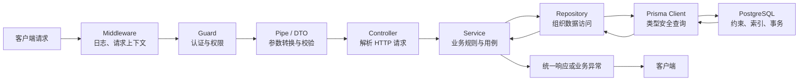
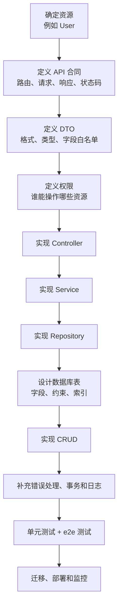
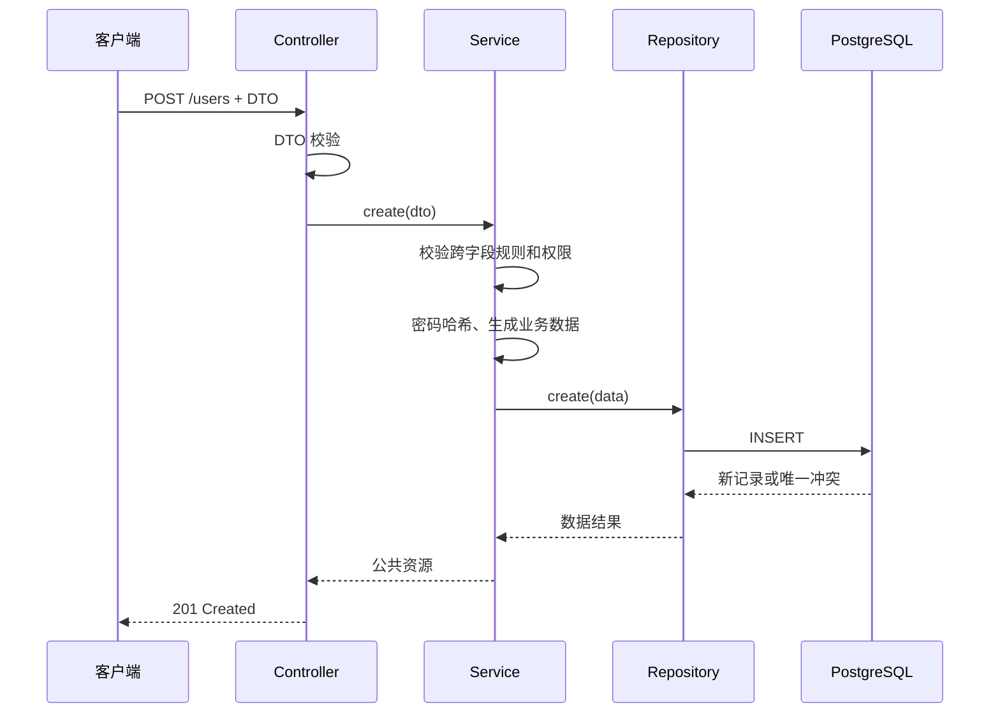
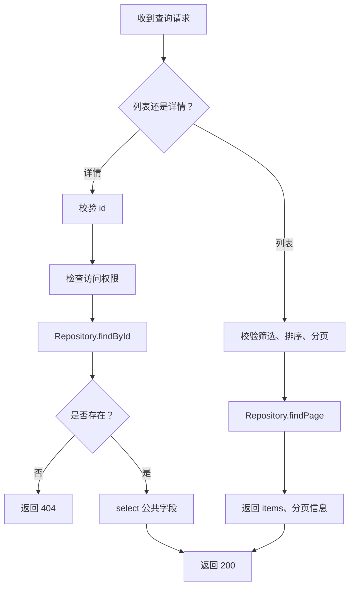
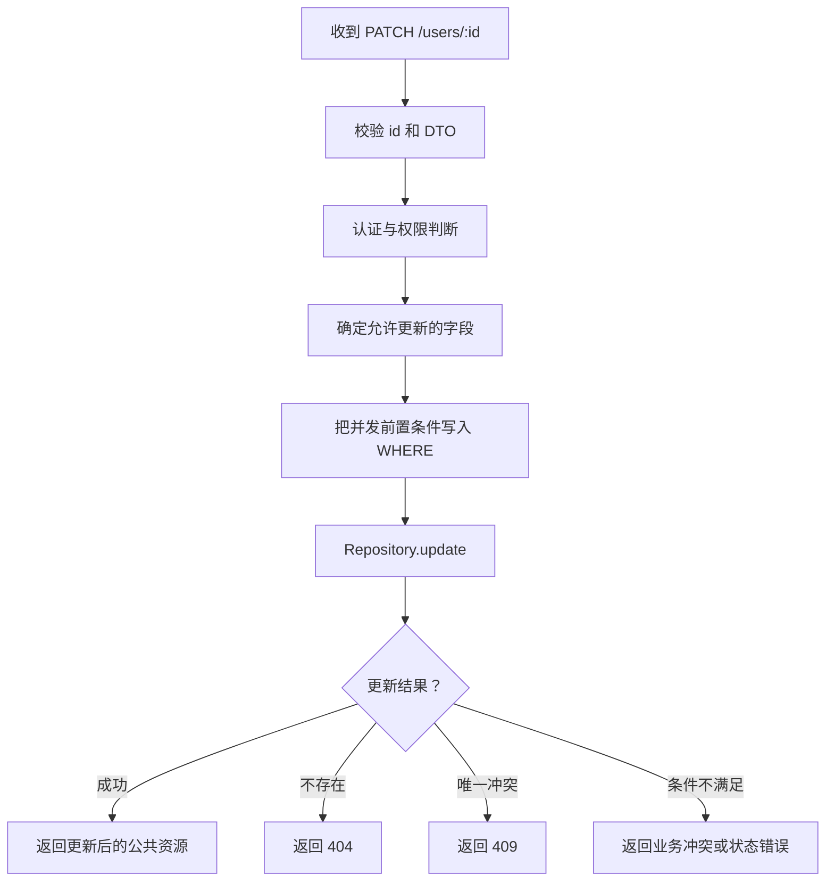
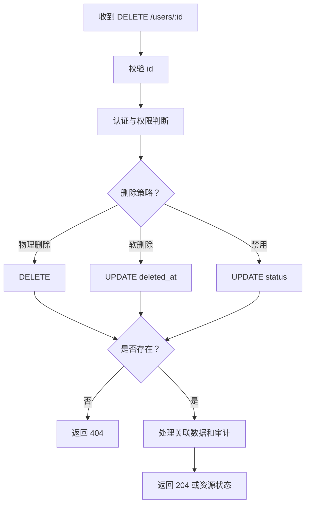
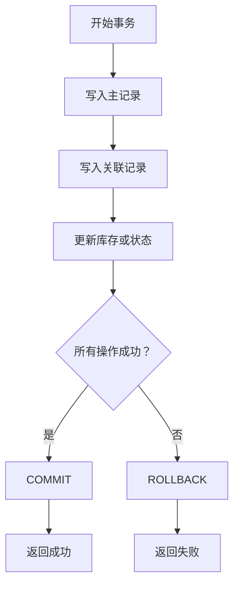
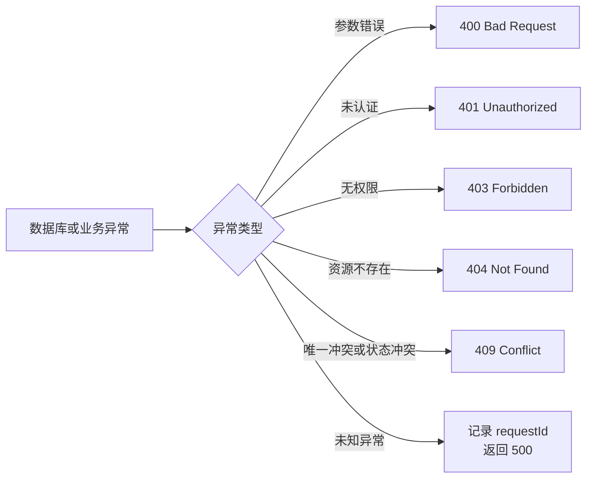
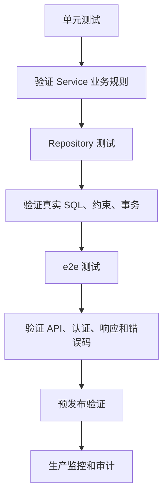

# 后端 CRUD 流程与设计思想

CRUD 是后端最基础、也最常见的一类业务能力：

- **C - Create**：创建资源
- **R - Read**：读取资源
- **U - Update**：更新资源
- **D - Delete**：删除资源

CRUD 不只是把四条 SQL 或四个接口拼在一起。一个完整的后端 CRUD，还需要处理：
参数校验、身份认证、权限判断、业务规则、数据库约束、事务、错误响应和测试。

本文以本项目的 NestJS + Prisma + PostgreSQL 为例，说明一个后端 CRUD 请求是怎样
流转的，以及设计 CRUD 时应该遵循哪些思想。

## 1. CRUD 的核心思想

### 1.1 围绕资源设计

先确定系统正在管理什么资源，再设计接口和数据表。

例如用户资源：

| 业务动作 | HTTP 方法 | 路径 | 含义 |
| --- | --- | --- | --- |
| 创建用户 | `POST` | `/users` | 新增一个用户 |
| 查询用户列表 | `GET` | `/users` | 获取多个用户 |
| 查询用户详情 | `GET` | `/users/:id` | 获取一个用户 |
| 更新用户 | `PATCH` | `/users/:id` | 修改用户允许修改的字段 |
| 删除用户 | `DELETE` | `/users/:id` | 删除、禁用或软删除用户 |

资源应该使用名词表示，动作由 HTTP 方法表示。通常不建议把接口写成
`POST /createUser`、`POST /deleteUser` 这种“动词 + 名词”的形式。

### 1.2 先定义规则，再写代码

设计 CRUD 前先回答这些问题：

1. 谁可以创建、查看、修改和删除？
2. 哪些字段必填，哪些字段允许为空？
3. 哪些字段可以被客户端修改？
4. 资源不存在时返回什么？
5. 唯一字段冲突时返回什么？
6. 删除是物理删除、软删除，还是仅仅禁用？
7. 多张表一起修改时是否需要事务？
8. 列表是否需要分页、筛选、排序和总数？

这些问题就是 CRUD 的业务合同。Controller 和数据库只是合同的实现方式。

## 2. 一次后端请求的完整流程



在当前项目中，代码调用方向是：

```text
UsersController
  -> UsersService
  -> UsersRepository
  -> PrismaService
  -> PostgreSQL
```

请求可以向下调用，结果和异常向上返回。下层不应该反过来调用 Controller，
Repository 也不应该直接决定 HTTP 状态码。

## 3. 每一层负责什么

### 3.1 Controller：处理 HTTP 语义

Controller 负责：

- 声明路由和 HTTP 方法；
- 接收 `body`、`params`、`query`；
- 使用 DTO 接收经过校验的输入；
- 调用 Service；
- 设置合适的 HTTP 状态码。

Controller 不负责：

- 拼接 SQL；
- 计算复杂业务规则；
- 校验用户是否有权修改目标资源；
- 返回密码哈希、令牌哈希等敏感字段。

```ts
@Controller('users')
export class UsersController {
  constructor(private readonly usersService: UsersService) {}

  @Get(':id')
  getById(@Param('id') id: string) {
    return this.usersService.getById(id);
  }

  @Patch(':id')
  update(@Param('id') id: string, @Body() dto: UpdateUserDto) {
    return this.usersService.updateProfile(id, dto);
  }
}
```

Controller 越薄，越容易测试，也越不容易把 HTTP 细节扩散到业务层。

### 3.2 DTO / Pipe：保护输入边界

DTO 负责描述客户端允许提交什么：

```ts
export class UpdateUserDto {
  @IsOptional()
  @IsString()
  @Matches(/^1[3-9]\d{9}$/)
  phone?: string;
}
```

DTO 校验可以保证格式正确，但不能代替权限和业务判断：

- DTO 可以验证手机号格式；
- Service 判断当前用户能不能修改这个手机号；
- 数据库唯一约束保证手机号不会被重复占用。

### 3.3 Service：实现业务用例

Service 是 CRUD 的核心。它负责：

- 组织一个完整业务动作；
- 执行跨字段、跨表的业务规则；
- 判断资源是否存在；
- 检查当前操作者是否有权限；
- 调用密码哈希、文件服务等领域能力；
- 把数据库错误翻译成稳定的业务错误；
- 决定是否开启事务。

例如“更新手机号”不是简单地把 DTO 交给 Prisma：

```text
接收 userId 和 UpdateUserDto
  -> 判断操作者是否能修改该用户
  -> 如果手机号发生变化，清除 phoneVerifiedAt
  -> 调用 Repository 更新允许修改的字段
  -> 捕获唯一冲突并转换为业务异常
  -> 返回公共用户信息
```

### 3.4 Repository：集中数据访问

Repository 负责：

- 调用 Prisma 查询；
- 组织 `where`、`select`、`include`、`orderBy`；
- 管理分页参数对应的查询；
- 返回数据库结果。

Repository 不负责：

- 判断当前 HTTP 用户是否是管理员；
- 决定返回 `400` 还是 `404`；
- 处理密码明文；
- 调用外部 HTTP 服务。

```ts
findById(id: string) {
  return this.prisma.user.findUnique({
    where: { id },
    select: publicUserSelect,
  });
}
```

查询时使用 `select` 是一个重要边界，可以从源头避免返回
`passwordHash`、`tokenHash` 等敏感字段。

### 3.5 Database：保证最终一致性

应用层校验用于提供友好提示，数据库约束用于阻止并发和绕过应用的错误写入：

- `PRIMARY KEY`：保证主键唯一；
- `NOT NULL`：保证必填字段不为空；
- `UNIQUE`：保证用户名、手机号等字段不重复；
- `FOREIGN KEY`：保证关联记录有效；
- `CHECK`：保证数值和状态在合法范围内；
- `INDEX`：提高真实查询的执行效率；
- `TRANSACTION`：保证多步写入的原子性。

## 4. CRUD 总体流程图



这条流程体现了一个重要思想：CRUD 不是从数据库表直接生成接口，而是从业务资源
和业务规则出发，逐层落到数据访问。

## 5. Create：创建资源

### 5.1 创建流程



### 5.2 创建的关键思想

创建时不要只做“收到参数就插入”：

1. **输入校验**：判断类型、长度、格式和必填字段。
2. **跨字段校验**：例如用户名存在时必须同时提供密码。
3. **敏感数据处理**：密码只保存哈希，不保存明文。
4. **唯一性依赖数据库**：不能只使用“先查再插入”。
5. **返回公共字段**：创建成功后不要返回密码哈希。
6. **正确映射冲突**：唯一约束冲突通常返回 `409 Conflict`。

```ts
try {
  return await this.prisma.user.create({
    data: {
      username: dto.username,
      passwordHash: dto.password
        ? await hashPassword(dto.password)
        : undefined,
    },
    select: publicUserSelect,
  });
} catch (error) {
  // Prisma P2002 应在 Service 层转换为业务异常
  throw error;
}
```

## 6. Read：读取资源

### 6.1 读取流程



### 6.2 列表查询的关键思想

- 必须限制 `pageSize` 或 `take` 的最大值；
- 必须有稳定排序，例如 `createdAt DESC, id DESC`；
- 大数据量场景要评估游标分页；
- 搜索条件必须经过 DTO 校验；
- 只查询接口真正需要的列；
- 总数统计不是所有场景都必须实时返回；
- 管理员列表和普通用户列表的权限范围要分开。

```ts
const result = await this.prisma.user.findMany({
  where,
  select: publicUserSelect,
  orderBy: [{ createdAt: 'desc' }, { id: 'desc' }],
  skip: (page - 1) * pageSize,
  take: pageSize,
});
```

详情查询找不到资源时，应由 Service 统一转换为 `NotFoundException`，而不是把
Prisma 的原始错误直接返回给客户端。

## 7. Update：更新资源

### 7.1 更新流程



### 7.2 更新的关键思想

1. **使用字段白名单**：不要把整个请求体直接传给 Prisma。
2. **区分 PUT 和 PATCH**：`PATCH` 是部分更新，未提交的字段不应被清空。
3. **保护不可修改字段**：例如 `id`、角色、创建时间、密码哈希。
4. **使用条件更新**：把状态条件写进 `WHERE`，减少并发覆盖。
5. **维护关联状态**：手机号变化后，应清除旧的验证时间。
6. **检查影响行数**：`updateMany` 返回的 `count` 可以反映条件是否满足。

```sql
UPDATE users
SET
  phone = '13800138000',
  phone_verified_at = NULL,
  updated_at = CURRENT_TIMESTAMP
WHERE id = 'user_demo_001'
  AND phone <> '13800138000';
```

## 8. Delete：删除资源

### 8.1 删除流程



### 8.2 删除的关键思想

删除不是默认执行 `DELETE FROM ...`。要先明确：

- 数据是否需要恢复？
- 是否需要保留审计记录？
- 是否有订单、会话等关联数据？
- 关联数据是级联删除、禁止删除，还是保留并解除关联？
- 唯一字段在软删除后是否允许被新记录重新使用？

用户、订单、支付和审计数据通常不能随意物理删除。软删除或状态变更更常见，但
必须保证所有读取接口默认过滤已删除或已禁用数据。

## 9. 事务：把多个动作当成一个动作

如果一个业务动作包含多次写入，就要考虑事务：



例如“创建用户并创建首个会话”：

```ts
await prisma.$transaction(async (tx) => {
  const user = await tx.user.create({
    data: {
      username,
      passwordHash,
    },
  });

  await tx.authSession.create({
    data: {
      id: sessionId,
      userId: user.id,
      tokenHash,
      expiresAt,
    },
  });
});
```

事务中的操作应当短小、可控。不要在事务中调用短信、支付、远程 HTTP 等外部服务，
否则外部服务变慢时会长期占用数据库连接和锁。

## 10. 错误处理流程



错误响应应该稳定、可理解，但不能泄漏：

- SQL 语句；
- 数据库连接串；
- 表结构细节；
- 密码哈希；
- token 原文；
- 短信验证码；
- 堆栈和内部文件路径。

可以在 Service 层把 Prisma 错误转换为领域异常：

```ts
if (error instanceof Prisma.PrismaClientKnownRequestError) {
  if (error.code === 'P2002') {
    throw new ConflictException('资源已存在');
  }

  if (error.code === 'P2025') {
    throw new NotFoundException('资源不存在');
  }
}
```

## 11. CRUD 的设计原则

### 原则一：Controller 薄，Service 清晰

Controller 负责 HTTP，Service 负责业务，Repository 负责数据访问。不要让
Controller 直接操作 Prisma，也不要把所有业务判断写在 Repository 中。

### 原则二：输入和输出都要有边界

输入使用 DTO 白名单，输出使用 `select` 或公共响应类型。用户提交什么字段，不代表
系统就允许修改什么字段。

### 原则三：应用校验和数据库约束同时存在

应用校验提供友好提示，数据库约束保证最终一致性。两者不能互相替代。

### 原则四：围绕业务动作组织代码

不要只追求通用的 `create()`、`update()` 方法。更清晰的代码通常会表达业务意图：

```text
registerUser()
verifyPhone()
disableUser()
consumeVerificationCode()
revokeSession()
```

方法名表达业务动作，调用方更容易理解，也更容易加入权限和事务规则。

### 原则五：查询要有边界

所有列表接口都要限制分页数量；所有更新和删除都要有明确条件；所有敏感字段都要
从查询结果中排除。

### 原则六：并发场景使用原子操作

“先查询，再判断，再更新”在并发下可能失效。优先使用：

- 条件 `UPDATE`；
- `UPDATE ... RETURNING`；
- 唯一约束；
- 短事务；
- 必要时的行锁或乐观锁。

### 原则七：删除语义要明确

物理删除、软删除和禁用不是一回事。选择一种策略后，要同步设计查询过滤、唯一索引、
恢复流程、审计和数据保留周期。

## 12. CRUD 测试闭环



至少测试以下内容：

- 创建成功；
- DTO 非法字段被拒绝；
- 唯一字段冲突返回 `409`；
- 查询不存在资源返回 `404`；
- 普通用户不能操作其他用户；
- 更新只修改白名单字段；
- 并发条件更新不会重复消费或覆盖；
- 删除策略和级联关系符合预期；
- 响应中没有密码哈希、令牌哈希和验证码。

## 13. 一句话总结 CRUD

CRUD 的本质是：

```text
围绕资源定义接口
  -> 用 DTO 保护输入
  -> 用 Guard 控制身份和权限
  -> 用 Service 执行业务规则
  -> 用 Repository 访问数据库
  -> 用数据库约束和事务保证一致性
  -> 用统一响应和测试形成闭环
```

因此，好的 CRUD 不是代码最少，而是每个规则都有明确的归属：

| 问题 | 负责位置 |
| --- | --- |
| 请求格式是否正确 | DTO / Pipe |
| 当前用户是否登录 | Guard |
| 当前用户是否有权限 | Guard / Service |
| 业务状态是否允许操作 | Service |
| SQL 如何执行 | Repository / Prisma |
| 数据是否最终合法 | PostgreSQL 约束 |
| 多次写入是否一起成功 | Transaction |
| 错误如何对外表达 | Service / 全局异常处理 |
| 行为是否真的可靠 | Unit / Repository / e2e 测试 |

